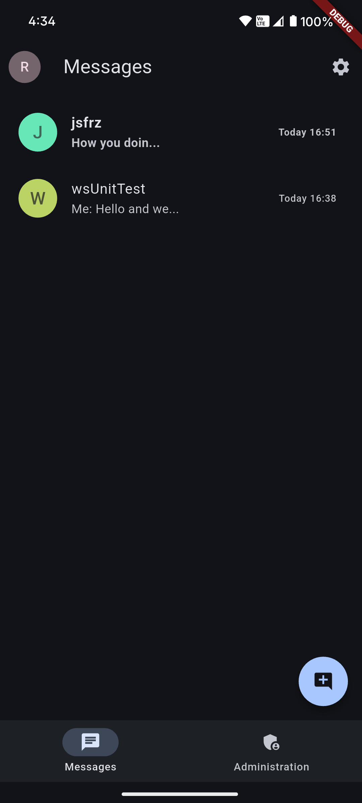
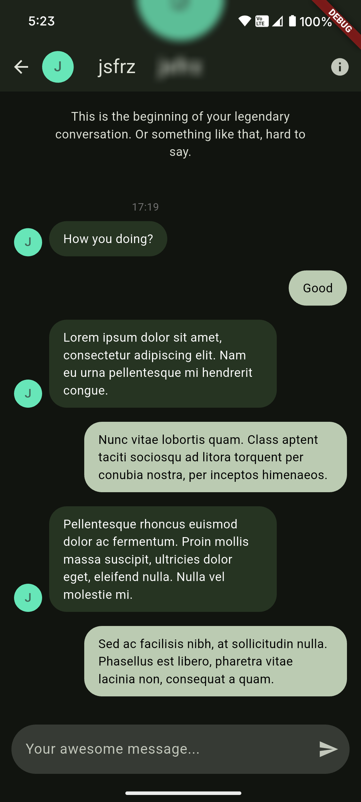
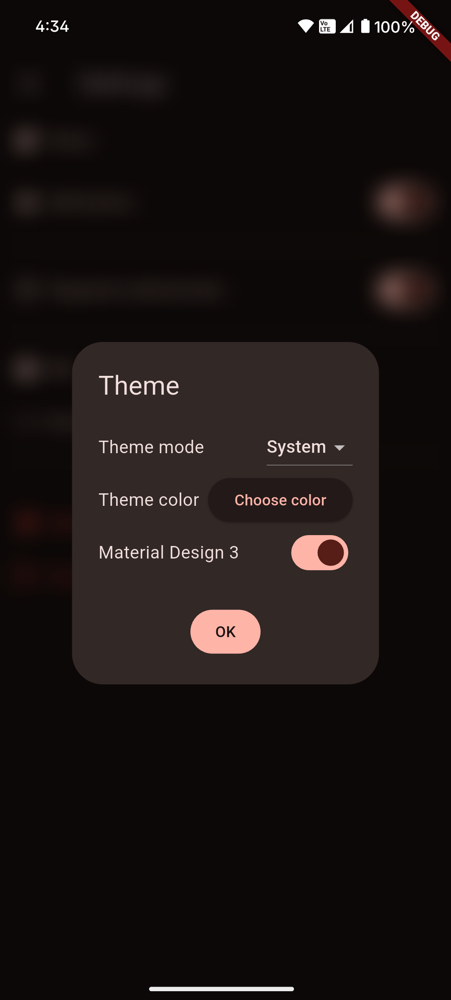

# whisper

Secure private self-hosted end-to-end encryption messaging app.

For Whisper server, see [whisper-server](https://github.com/jsfraz/whisper-server) repository.

Also see [Wiki](https://github.com/jsfraz/whisper/wiki)!

|   |   |   |
|---|---|---|
||||

## Download

You can download the app [here in the releases](https://github.com/jsfraz/whisper/releases).

## Dependencies

- [basic_utils](https://pub.dev/packages/basic_utils)
  - used for cryptography
- [bcrypt](https://pub.dev/packages/bcrypt)
  - used for password hashing
- [crypto](https://pub.dev/packages/crypto)
  - used for cryptography
- [cryptography](https://pub.dev/packages/cryptography)
  - used for cryptography
- [dart_jsonwebtoken](https://pub.dev/packages/dart_jsonwebtoken)
  - used for JWT token handling
- [easy_localization](https://pub.dev/packages/easy_localization)
  - used for app internationalization
- [email_validator](https://pub.dev/packages/email_validator)
  - used for email format validation
- [flutter_colorpicker](https://pub.dev/packages/flutter_colorpicker)
  - used for color selection in UI
- [flutter_launcher_icons](https://pub.dev/packages/flutter_launcher_icons)
  - used for generating app icons
- [flutter_local_notifications](https://pub.dev/packages/flutter_local_notifications)
  - used for local push notifications
- [fluttertoast](https://pub.dev/packages/fluttertoast)
  - used for showing toast messages
- [hive](https://pub.dev/packages/hive)
  - used for local data storage
- [http](https://pub.dev/packages/http)
  - used for HTTP requests
- [json_annotation](https://pub.dev/packages/json_annotation)
  - used for JSON serialization annotations
- [jwt_decoder](https://pub.dev/packages/jwt_decoder)
  - used for JWT token decoding
- [local_auth](https://pub.dev/packages/local_auth)
  - used for biometric authentication
- [mobile_scanner](https://pub.dev/packages/mobile_scanner)
  - used for QR code scanning
- [page_transition](https://pub.dev/packages/page_transition)
  - used for custom page transitions
- [path_provider](https://pub.dev/packages/path_provider)
  - used for accessing device file system paths
- [pointycastle](https://pub.dev/packages/pointycastle)
  - used for cryptographic algorithms
- [provider](https://pub.dev/packages/provider)
  - used for state management
- [qr_code_scanner_plus](https://pub.dev/packages/qr_code_scanner_plus)
  - used for enhanced QR code scanning
- [sprintf](https://pub.dev/packages/sprintf)
  - used for string formatting
- [url_launcher](https://pub.dev/packages/url_launcher)
  - used for launching URLs
- [vibration](https://pub.dev/packages/vibration)
  - used for device vibration feedback
- [whisper_openapi_client_dart](https://github.com/jsfraz/whisper_openapi_client_dart)
  - used for API communication with Whisper server
- [whisper_websocket_client_dart](https://github.com/jsfraz/whisper_websocket_client_dart)
  - used for real-time WebSocket communication with Whisper server

### Dev dependencies

- [flutter_test](https://flutter.dev/docs/testing)
  - used for unit and widget testing
- [flutter_lints](https://pub.dev/packages/flutter_lints)
  - used for code linting and style enforcement
- [hive_generator](https://pub.dev/packages/hive_generator)
  - used for generating Hive type adapters
- [build_runner](https://pub.dev/packages/build_runner)
  - used for code generation
  - run `dart run build_runner build` to generate code+
- [json_serializable](https://pub.dev/packages/json_serializable)
  - used for generating JSON serialization code

### Other

- [flutter_launcher_icons](https://pub.dev/packages/flutter_launcher_icons)
  - used for generating app icons
  - run `dart run flutter_launcher_icons` to generate icons
  - see configuration file [flutter_launcher_icons.yaml](flutter_launcher_icons.yaml)

## Firebase Messaging

- [Firebase](https://firebase.google.com/)
  - used for push notifications when user is offline
  - see [Firebase setup for Flutter](https://firebase.google.com/docs/flutter/setup) and [Firebase Cloud Messaging for Flutter](https://firebase.google.com/docs/cloud-messaging/flutter/client) for more details how to implement this
  - app specific configuration files [are not included](.gitignore) in the repository, you need to create them yourself if you plan self host Whisper (refer to [whisper-server](https://github.com/jsfraz/whisper-server) repository for more details)

### Development

To setup Firebase using Flutterfire you can run:

```bash+
flutterfire configure
```

Or run this for the development environment:

```bash
flutterfire configure \
  --android-package-name cz.josefraz.whisper.debug \
  --ios-bundle-id cz.josefraz.whisper.debug
```

Then select your Firebase project. This will generate the necessary `firebase.json` and `lib/firebase_options.dart` files.

## Continuous Integration a Deployment (CI/CD)

The application uses GitHub Actions to automatically build and release the APK file when pushing to the `main` branch. For this process to work correctly, the following secret keys must be set in the repository settings (Settings > Secrets and variables > Actions):

- `FIREBASE_JSON_BASE64` - base64 encoded contents of the `firebase.json` file
- `FIREBASE_OPTIONS_DART_BASE64` - base64 encoded contents of the `lib/firebase_options.dart` file (required)
- `GOOGLE_SERVICES_JSON_BASE64` - base64 encoded contents of the `android/app/google-services.json` file
<!--
- `GOOGLE_SERVICE_INFO_PLIST_BASE64` - base64 encoded contents of the `ios/Runner/GoogleService-Info.plist` file
-->

These secret keys will be used during application build to generate the necessary Firebase configuration files, which are not included in the repository for security reasons. The base64 encoding ensures safe transmission and prevents issues with special characters.

### Procedure for setting up CI/CD

1. In the repository, go to Settings > Secrets and variables > Actions
2. For each configuration file, encode it to base64 format:
   - **Linux/macOS**: `base64 -w 0 < firebase.json` (copy the output)
   - **Windows**: `[Convert]::ToBase64String([IO.File]::ReadAllBytes("firebase.json"))` (in PowerShell)
3. Click on "New repository secret" for each of the secret keys listed above
4. Paste the base64 encoded content as the secret key value

After setting these secret keys, the workflow will automatically build the APK on every push to the `main` branch and create a new GitHub Release with the version according to `pubspec.yaml`.
